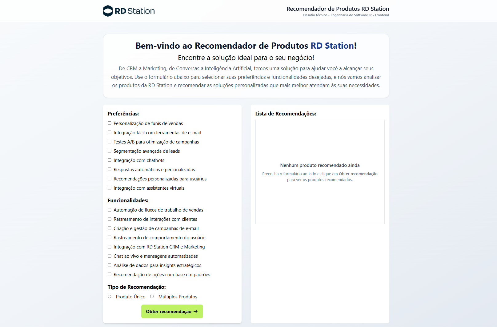
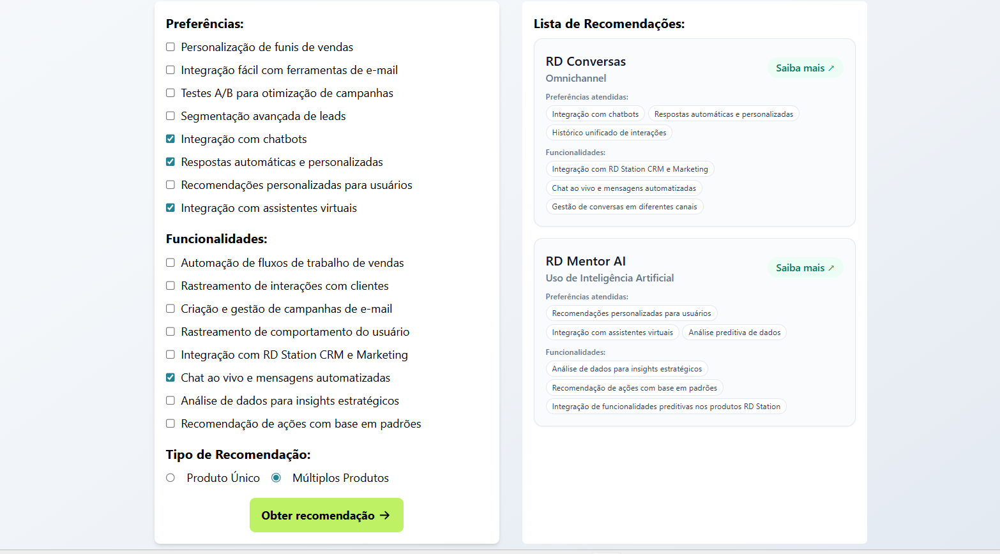

# Frontend – Recomendador de Produtos RD Station

Aplicação React responsável por:

- coletar preferências e funcionalidades desejadas pelo usuário;
- consultar os produtos da API (json-server);
- aplicar a lógica de recomendação por **score**;
- exibir as recomendações em **cards informativos**, com link direto para a página oficial de cada produto RD Station.

---

## 🌐 Demonstração

> 🔗 **Link da aplicação em produção:**  


Em ambiente de desenvolvimento, o frontend consome os dados a partir do json-server.
Em produção (ex.: deploy na Vercel) e nos testes, a aplicação utiliza o mockProducts local (src/mocks/mockProducts.js) para garantir uma demo estável.

---

## 🖼️ Screenshots

- **Tela inicial / formulário**



- **Recomendações em cards com links**
  




---

## Tecnologias utilizadas

- **React.js** 
- **Tailwind CSS** – estilização e layout responsivo
- **Axios** – consumo da API fake (json-server)
- **Jest + React Testing Library** – testes unitários

---

## ▶️ Como rodar o frontend

Certifique-se de que está dentro da pasta `frontend`:

```bash
cd frontend
yarn install
yarn start
```
Por padrão, a aplicação sobe em:
http://localhost:3000
⚠️ Importante: o backend (json-server) deve estar rodando em http://localhost:3001/products
(subido a partir da pasta backend usando yarn start ou o script do monorepo).

---

## 🧩 Estrutura do frontend
```bash
src/
├── App.js
├── assets/
│   └── logo.svg
├── components/
│   ├── Form/
│   │   ├── Form.js
│   │   ├── Fields/
│   │   │   ├──Features.js
│   │   │   ├──Preferences.js
│   │   │   └──RecommendationType.js
│   │   └── SubmitButton/
│   │       └──SubmitButton.js
│   ├── RecommendationList/
│   │   └── RecommendationList.js
│   └── shared/
│       └── Checkbox.js
├── hooks/
│   ├── useForm.js
│   ├── useProducts.js
│   └── useRecommendations.js
└── services/
    ├── product.service.js
    └── recommendation.service.js
```

## 🎨 Diferenciais de implementação no frontend

Além de atender aos requisitos do desafio, foram implementadas melhorias para tornar a solução mais robusta, legível e agradável:

- Layout aprimorado com Tailwind
- Header com: logo da RD Station, título claro da aplicação, subtítulo contextualizando o desafio técnico.
- Layout em grid:
lado esquerdo: formulário de seleção (preferências, funcionalidades, tipo de recomendação),
lado direito: lista de recomendações em destaque.
Uso de cards, espaçamento e tipografia pensados para leitura rápida.

## Lógica de Recomendação do projeto

A lógica de recomendação foi centralizada em recommendation.service.js e funciona por pontuação:

### Cálculo de score
Para cada produto, é calculado um score numérico com base nas seleções do usuário:
  - Cada preferência selecionada que aparece em product.preferences → +2 pontos cada
  - Cada funcionalidade selecionada que aparece em product.features → +1 ponto cada

Isso permite priorizar produtos que atendem melhor às preferências do usuário, e ainda considerar funcionalidades como fator complementar.

### Filtros ativos

- Se o usuário selecionar pelo menos uma preferência ou funcionalidade, apenas produtos com score > 0 são considerados candidatos.

- Se o usuário não selecionar nenhum critério, todos os produtos são considerados, com score inicial 0. Esse comportamento permite, por exemplo, mostrar um “catálogo” básico mesmo sem filtros.

### Modos de Recomendação

O serviço suporta dois modos:
  - SingleProduct: 
    - retorna um único produto, aquele com maior score;
    - em caso de empate, retorna o último produto entre os empatados (critério pedido no desafio).

  - MultipleProducts:
    - retorna uma lista de produtos que atendem ao filtro;
    - se não houver match, retorna [].

Também foram tratados cenários especiais:
  - quando não há produtos disponíveis;
  - quando nenhum critério é selecionado;
  - quando o tipo de recomendação não é informado (fallback para SingleProduct).

## 🧾 Cards informativos com link “Saiba mais”

Cada recomendação é exibida como um card, contendo:
- nome do produto (ex.: RD Conversas);
- categoria;
- um conjunto resumido de preferências/funcionalidades;
- um link “Saiba mais” apontando para a página oficial do produto

## 🧠 Arquitetura do frontend

### App.js: 
- Controla o estado de recommendations.
- Renderiza:
  - o header com logo + contexto,
  - um texto introdutório explicando o propósito do recomendador,
  - a estrutura em grid com:
    `<Form />` (entrada),
    `<RecommendationList />` (saída).

Fluxo principal:
  1. O Form recebe uma função onRecommendationsChange.
  2. Quando o usuário envia o formulário, o Form chama o service de recomendação.
  3. O resultado é normalizado e enviado para o App via onRecommendationsChange.
  4. O App passa a lista final para <RecommendationList />, que exibe os cards.

### Hooks
`useProducts`:

Responsável por:
  - Buscar os produtos da API (product.service).
  - Popular:
      - products: lista completa de produtos,
      - preferences: subconjunto de preferências extraídas dos produtos,
      - features: subconjunto de funcionalidades.

`useForm`:

Hook simples e genérico para controle do estado de formulário:
  - formData: estado atual do formulário.
  - handleChange(field, value): atualiza qualquer campo de forma declarativa.

`useRecommendations`:
Função responsável por conectar o React ao serviço de recomendação

## 🧪 Testes
- Como rodar os testes

Na pasta frontend:
```bash
yarn test
```

- Cobertura implementada:
  - `services/recommendation.service.test.js`
    - Recomendações em modo:
      SingleProduct (produto único, melhor score, empate → último match),
      MultipleProducts (lista de matches).
    - Cenários sem match (retorno null / [] conforme o modo).
    - Comportamento quando não há produtos disponíveis.
    - Comportamento quando o tipo de recomendação não é informado (fallback).
  
  - `hooks/useProducts.test.js`
    - Garante que:
      getProducts é chamado uma única vez,
      products recebe o retorno da API, 
      preferences e features são montados a partir dos produtos,
      erros ao buscar produtos não quebram o hook (tratamento de erro com console.error).

  - `hooks/useRecommendations.test.js`
    - Garante que:
      recommendationService.getRecommendations é chamado com formData e products,
      o valor retornado pelo service é repassado corretamente pelo hook.
  
  - `components/Form/Form.test.js`
    - Garante que:
    ao submeter o formulário, getRecommendations é chamado,
    o retorno (objeto ou lista) é normalizado para lista,
    onRecommendationsChange é chamado com o array final de recomendações.

## 🔮 Possíveis evoluções

Algumas ideias futuras para expansão da solução:
  - Ajustar pesos de score (ex.: permitir que o usuário dê mais peso para certas preferências).
  - Mostrar “por que esse produto foi recomendado” (ex.: destacar tags que bateram com o filtro).
  - Melhorar acessibilidade (foco visível, ARIA, navegação por teclado em todos os campos e cards).
  - Salvar últimas recomendações no localStorage para manter o estado entre reloads.


## 👤 Autora

Desenvolvido por [Elane Alencar](https://linkedin.com/in/elanealencar/)
Candidata à vaga de Pessoa Engenheira de Software Frontend (Jr/Pleno) – RD Station.